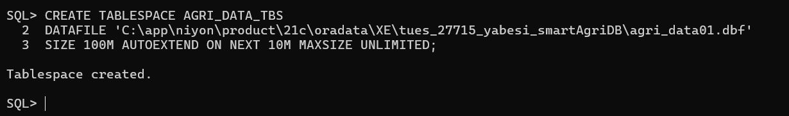
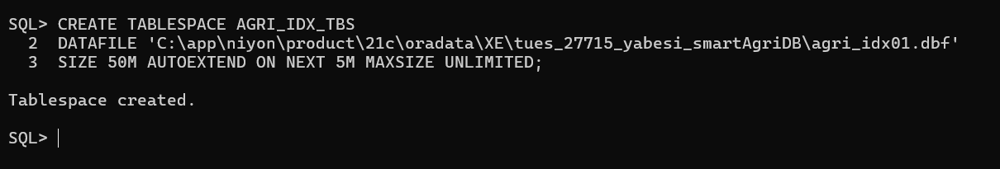

# Oracle Database Setup: Pluggable Database and Tablespaces

**Project:** IoT-Based Smart Agriculture Management System  
**Student:** NIYONKURU NYIRIMPETA Yabesi  
**Student ID:** 27715  
**Database:** Oracle 21c  

---

## Objective

The objective of this setup is to create a dedicated **Pluggable Database (PDB)** for the Smart Agriculture system, configure required **tablespaces**, enable **archive logging**, and grant administrative privileges to the project database user.

---

## Step 1: Create the Pluggable Database (PDB)

A new pluggable database named `tues_27715_yabesi_smartAgriDB` was created from the Oracle XE seed database.  
An administrative user was defined during creation.

```sql
CREATE PLUGGABLE DATABASE tues_27715_yabesi_smartAgriDB
ADMIN USER admin_yabesi IDENTIFIED BY Yabesi
ROLES = (DBA)
DEFAULT TABLESPACE AGRI_DATA_TBS
FILE_NAME_CONVERT = (
  'C:\app\niyon\product\21c\oradata\XE\pdbseed',
  'C:\app\niyon\product\21c\oradata\XE\tues_27715_yabesi_smartAgriDB'
);
```

## Step 2: Connect to the New Pluggable Database

```sql
ALTER SESSION SET CONTAINER = tues_27715_yabesi_smartAgriDB;

ALTER PLUGGABLE DATABASE tues_27715_yabesi_smartAgriDB OPEN;

ALTER PLUGGABLE DATABASE tues_27715_yabesi_smartAgriDB SAVE STATE;
```

## Step 3: Create Tablespaces
## 3.1 Data Tablespace
```sql
CREATE TABLESPACE AGRI_DATA_TBS
DATAFILE 'C:\app\niyon\product\21c\oradata\XE\tues_27715_yabesi_smartAgriDB\agri_data01.dbf'
SIZE 100M
AUTOEXTEND ON NEXT 10M
MAXSIZE UNLIMITED;
```



## 3.2 Index Tablespace
```sql
CREATE TABLESPACE AGRI_IDX_TBS
DATAFILE 'C:\app\niyon\product\21c\oradata\XE\tues_27715_yabesi_smartAgriDB\agri_idx01.dbf'
SIZE 50M
AUTOEXTEND ON NEXT 5M
MAXSIZE UNLIMITED;
```



## 3.3 Temporary Tablespace
```sql
CREATE TEMPORARY TABLESPACE AGRI_TEMP_TBS
TEMPFILE 'C:\app\niyon\product\21c\oradata\XE\tues_27715_yabesi_smartAgriDB\agri_temp01.dbf'
SIZE 50M
AUTOEXTEND ON NEXT 5M
MAXSIZE UNLIMITED;
```


## Step 4: Enable Archive Logging
```sql
ALTER DATABASE ARCHIVELOG;
```


## Step 5: Grant User Privileges
```sql
GRANT CONNECT, RESOURCE, DBA TO admin_yabesi;

```
