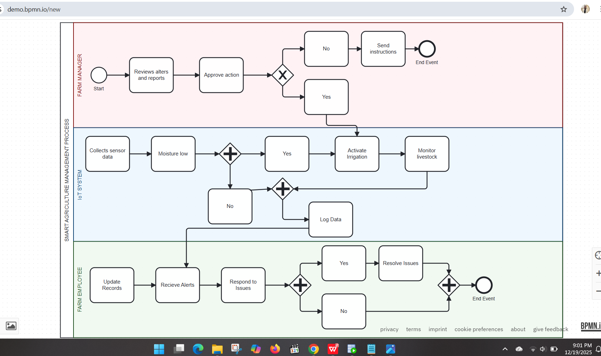
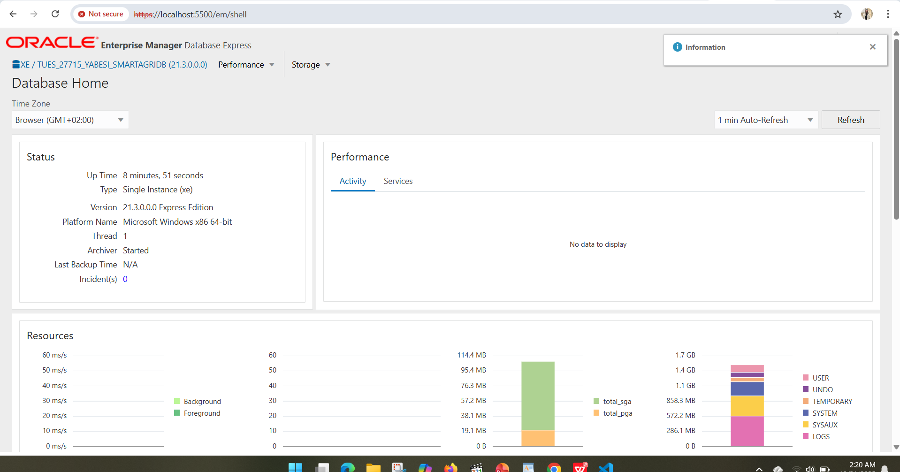

# Smart-Agriculture-Management-System
SmartFarm MIS is an Oracle PL/SQL capstone project that manages farms, crops, livestock, sensors, automation, and auditing using IoT-driven data.

---

**Author:** NIYONKURU NYIRIMPETA Yabesi  
**Student ID:** 27715  
**Course:** Database Development with PL/SQL  

---

## Project Overview
The **Smart Agriculture Management System** leverages IoT concepts and PL/SQL-based database management to modernize farming operations. The system integrates smart irrigation, crop monitoring, livestock tracking, pest detection, and greenhouse automation. Its main goal is to improve agricultural productivity, reduce resource wastage, and facilitate data-driven decision-making for sustainable farming.

---

## Key Features
- **Smart Irrigation:** Automated watering based on soil moisture sensor readings.  
- **Crop Monitoring:** Real-time monitoring of temperature, humidity, and environmental conditions.  
- **Livestock Tracking:** Monitoring animal health, body temperature, and location.  
- **Pest Detection:** Early detection using sensor data to prevent crop damage.  
- **Greenhouse Automation:** Controls temperature, humidity, and lighting.  
- **Data Analytics Ready:** Aggregations, window functions, and structured schema for BI integration.  
- **Audit & Restrictions:** User activity tracking, weekday & holiday restrictions enforced via triggers.  

---

## System Architecture

**Layers:**
1. **IoT Sensors Layer:** Soil moisture, temperature, humidity, pest sensors, livestock wearables.  
2. **Database Layer:** Oracle Database storing sensor readings, farm, livestock, and greenhouse data.  
3. **PL/SQL Logic Layer:** Procedures, functions, packages, triggers for automation and validation.  
4. **User Layer:** Farmers and managers access reports and monitor farm operations.

---

## Business Process Modeling (BPMN)

*Replace this with your BPMN diagram.*

**Scenario:**  
- A farmer places an order or initiates a monitoring check.  
- The system reads sensor data and triggers necessary actions: irrigation, pest control, or greenhouse adjustments.  
- Livestock data is continuously tracked and alerts are generated for abnormal conditions.  
- Audit logs track all user actions and system events.  

---

## Database Design
### Entities & Tables
- **FARMS:** Stores farm information.  
- **CROP_FIELDS:** Crop type, planting date, and associated farm.  
- **SENSORS:** Sensor information (Moisture, Temp, Humidity, Pest).  
- **SENSOR_READINGS:** Recorded sensor values over time.  
- **IRRIGATION_CONTROL:** Automated irrigation records.  
- **LIVESTOCK:** Animals on farms, health status.  
- **LIVESTOCK_TRACKING:** Animal location and body temperature.  
- **GREENHOUSE_CONTROL:** Greenhouse environmental control.  

### ER Diagram

*Replace this with your ERD diagram.*

**Normalization:** All tables are designed in **3NF** to ensure data integrity, minimize redundancy, and optimize storage.

---
## Oracle Enterprise Manager

*Replace this with your system architecture diagram.*

---

## PL/SQL Implementation
### Procedures
- `record_sensor_reading` – Inserts new sensor data.  
- `control_irrigation` – Automates irrigation based on sensor thresholds.  
- `detect_pest_risk` – Flags potential pest issues.  
- `monitor_livestock_health` – Checks livestock conditions.  
- `control_greenhouse` – Adjusts greenhouse environment automatically.  

### Functions
- Sensor validation, threshold checking, and lookup functions.  

### Cursors
- Explicit cursors for multi-row processing of sensor and livestock data.  
- Bulk operations for performance optimization.

### Packages
- `IRRIGATION_PKG` – All irrigation-related procedures.  
- `LIVESTOCK_PKG` – Livestock monitoring and management procedures.  
- `GREENHOUSE_PKG` – Greenhouse automation routines.  

### Triggers
- Restrict DML operations on weekdays and holidays.  
- Log all attempts in the **AUDIT_LOG** table.  

---

## SQL & Analytics
- **Window Functions:** ROW_NUMBER(), RANK(), DENSE_RANK(), LAG(), LEAD().  
- **Aggregations:** SUM, AVG, COUNT using `OVER` clause.  
- **Joins & Subqueries:** Multi-table retrieval and reporting queries.  

---

## Data Integrity & Testing
- Primary and foreign keys enforce relational integrity.  
- CHECK, NOT NULL, UNIQUE, and DEFAULT constraints maintain valid data.  
- Test queries ensure proper functionality of triggers, procedures, and functions.  

---

## Technical Stack
- **Database:** Oracle Database 19c / 21c  
- **Programming:** PL/SQL  
- **Modeling Tools:** Lucidchart / draw.io / Canva  
- **Version Control:** GitHub  

---

## Benefits
- Increased crop yield and efficient water usage.  
- Early detection of pests and livestock health issues.  
- Efficient greenhouse environment management.  
- Data analytics-ready for BI reporting.  

---

## Project Screenshots / Visuals
- System Architecture: ``  
- BPMN Process Flow: ``  
- ER Diagram: ``  
- Sample Data Tables / Reports: ``  

---

